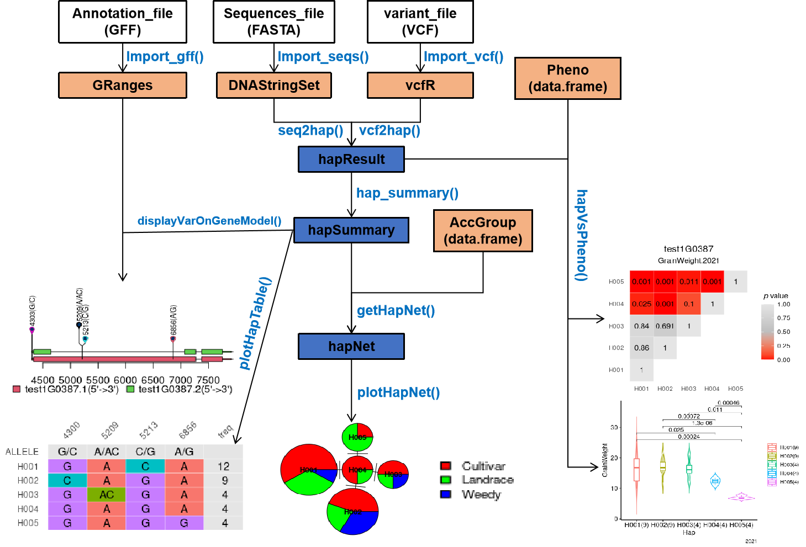

# geneHapR workfolw

## R Markdown

## Workflow

Haplotype analysis with `geneHapR` begins from **variant call format** file (VCF) or **DNA sequences** file (FASTA).

**Annotation file**, **phenotype data** (data.frame) and **accession group information** (data.frame) are conditionally needed but strongly also recommend.

The below workflow outlines the major steps involved in `geneHapR` usage.

The blue fonts indicate functions the user need to become familiar with.
There are effectively three phases in the workflow: firstly, import data; secondly, processing the objects in memory; and finally, visualization and export the results.
Import large data set frequently presents a bottleneck due to restriction of hardware performance and insufficient computer memory.
Fortunately, it is only a matter of time to import a large data set due to the former limitation.
It's suggest that perform haplotype analysis with a comparatively small range every time and then merge the results to get over the latter limitation.

Once the data sets are import into memory, we can continue the process with geneHapR.
There are three small steps in data processing.
First, we calculate haplotype result (an object of `hapResult` class) from VCF (object of `vcfR` class) or DNA Sequences (object of `DNAStringSet` class).
Next, we summarize the hap result (generate an object of `hapSummary` class) into a shorter table.
Finally, we compute the haplo network (generate an object of `haploNet` class) from summarized haplotpe result (suggest with accession groups information).

Finally, we can visualize and export the results.
Display variants on gene model with R base graphics package takes an object of `hapSummary` class and an object of `Granges` class contains genome annotations. .
Visualization of hapTable with `ggplot2` package takes an object of `hapSummary` class.
HapNet Visualization with R base graphics package takes an object of `haploNet` class.
Visualization of association between hap and phenotype with `ggplot2` package takes an object of `hapResult` class and an object of `data.frame` contains phenotype data.
Certainly, the user is able to make some modifications to the plots with command of `ggplot2` or R base graphics packages.

**Note that** the hap results (object of `hapResult` and `hapSummary` class) are able to export to drive or import from drive by `write.hap()` or `import_hap()`.         
